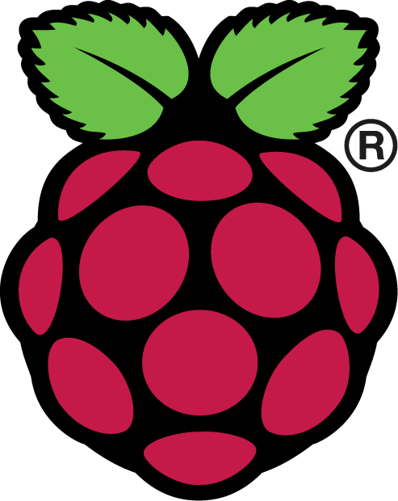

# Getting Setup
If you have any questions or get stuck as you work through this in-class exercise, please ask the instructor for assistance. Enjoy!

## Formatting the SD card and Installing Raspbian
1.  Open this document in your browser and so that you can click on the hyperlinks in the document: http://bit.ly/2MCdL7r
2.  Download a copy of the **Raspberry Pi OS with desktop** from the [Raspberry Pi website](https://www.raspberrypi.com/software/operating-systems/){:target="_blank"}
    -   **Note:** This download will be ~1GB in size. If the download looks like it will take more than 5 minutes, ask your instructor for a thumb drive copy.
3.  Install this [Etcher disk imager](https://www.balena.io/etcher/){:target="_blank"} for Windows, Mac, and Linux on your computer
4.  Using Etcher burn the disk image onto the SD card (If your computer does not have an SD card reader, you can borrow one from the Music and Media desk in the library):
    -   Put the SD card into the USB adapter/micro-adapter then into your computer.
    -   Unzip the Raspbian file downloaded in step 1, and open Etcher.
    -   Follow the directions in Etcher to copy the file to the SD card.
5.  Raspbian is now installed onto the SD card!
    -   If you are on windows, eject the drive before removing the SD card.
    -   If you are on a mac the drive will be ejected for you. Go ahead and remove the SD card.
    -   Insert the card into the SD port of the Raspberry Pi, connect the peripherals, and power it up.

## Initial Setup of Raspbian
6.  With all peripherals installed, allow the Raspberry Pi to boot into the desktop.
    -   The first thing you’ll be prompted to do will be to set up a new password, for the purposes of this lab set the password to be **raspberry**, or skip this step.
    -   When prompted, reboot your raspberry pi.
    -   Set the date and time on your raspberry pi: 
        -   Open the terminal by clicking on the icon on the top bar (see icon on right).
        -   In the terminal enter this command with the date and time then press enter: `sudo date -s 'mm/dd/yyyy hh:mm:ss'`
            -   Example: `sudo date -s '06/30/2023 11:40:00'`
    -   Connect to the internet through UVIC Guest WIFI:
        -   Click on the WIFI icon on the top bar and select "UVicStart". This will connect the Raspberry Pi to the UVIC network as a guest.
        -   Upon opening the Chromium web browser, the UVicStart Guest Wireless page should open. 
        -   Click the "REGISTER" button.
        -   Enter your email address and agree to the terms and conditions. You will be given 15 minutes of access to complete the registration.
        -   Log into the same email account on the Raspberry Pi. Note that Google Gmail could be very slow to respond on a Raspberry Pi 3, but will still work.
        -   Click the link at the top of the automatically sent email to complete the registration.
        -   At this point, you can sign out of your email account for security reasons.
        -   In order for the Raspberry Pi to accesss archive.raspberrypi.org for updates and software while connected to the UVIC network, run the following command: `sudo sysctl -w net.ipv6.conf.all.disable_ipv6=1`
        -   Once this is done, enter this command: `sudo apt-get update`
            -   Outside of the workshop you would want to run `sudo apt-get upgrade` as well, but we will not as that will take a long time!

## Installing New Software on Raspbian
7.  Enter the command: `sudo apt-get install <Software Name Here>`
    -   Example: `sudo apt-get install gimp`
8.  In a new terminal shell, we will install the Python interpreter: `sudo apt-get install python3`

## Introduction to Python Programming, Hello World and Nano
9.  With Python installed, open the terminal and enter: `python3`
    -   A new prompt should show up “**\>\>\>**”. This is the Python shell.
10.  In here simple Python commands can be executed. Try entering `x = 5`, then `y = 8`. These variables, x and y, are now set as the values 5 and 8.
     -   Type in `x+y` and press enter
     -   Try some other basic arithmetic commands with these variables!
     -   When you’re done type: `exit()` and press enter.
11.  In case we want to save a program, we need to be able to create new files. To do so, we will use nano.
     -   Enter this command `sudo nano hello_world.py`
     -   In the nano window, type in `message = ‘Hello, world!’` then on a new line `print(message)`.
     -   Now, to save the file, enter the keystroke `ctrl+x`, then press `Y`, then `Enter`. You should now be back in the terminal.
     -   From here, type in `python3 hello_world.py`

## Extended Configuration
12.  In the case that you need to, or want to, edit any of the core settings of the Raspberry Pi, open a terminal and execute this command: `sudo raspi-config`
13.  There are multiple configuration options here, to learn more checkout [this website](https://elinux.org/RPi_raspi-config){:target="_blank"}
14.  For an example of a useful feature, we will enable auto-login on the Raspberry Pi.
     -   After executing **raspi-config** (`sudo raspi-config`) navigate to **Boot Options** and press **Enter**
     -   Navigate to **Desktop/CLI** then to **Desktop Autologin** and **Enter**.
     -   You’ve now enabled autologin to the desktop.
     -   Navigate to the main menu, and hit **Tab** then **Exit** and reboot the Pi. It should now autoboot

## Projects
15.  Pick some projects!
     -   [Kiosk Computer](http://bit.ly/2ryOD9G){:target="_blank"}
     -   [Temp Log](http://bit.ly/38NjrnG){:target="_blank"}
     -   [Headless RbPi](http://bit.ly/3afHkoH){:target="_blank"}
     -   [Lakka Retro Gaming Computer](http://bit.ly/33CDwL7){:target="_blank"}
     -   [C64 Disk Hack](http://bit.ly/2O7ajSP){:target="_blank"}
     -   Or go to **Start Menu > Help > Projects** on the Raspberry Pi to view a list of projects in the Chromium web browser.

## Important Notes
16.  Reboot the Raspberry Pi (recommended after installing a system update or large applications): `sudo reboot`
17.  Shut down the Raspberry Pi: `sudo shutdown -h now`

[NEXT STEP: Retro Pi](act-2.html){: .btn .btn-blue }
