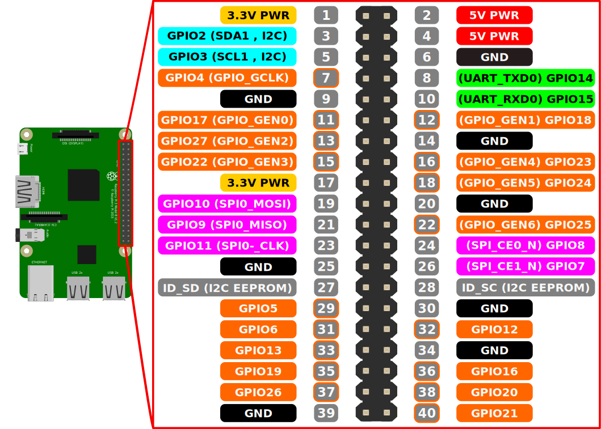
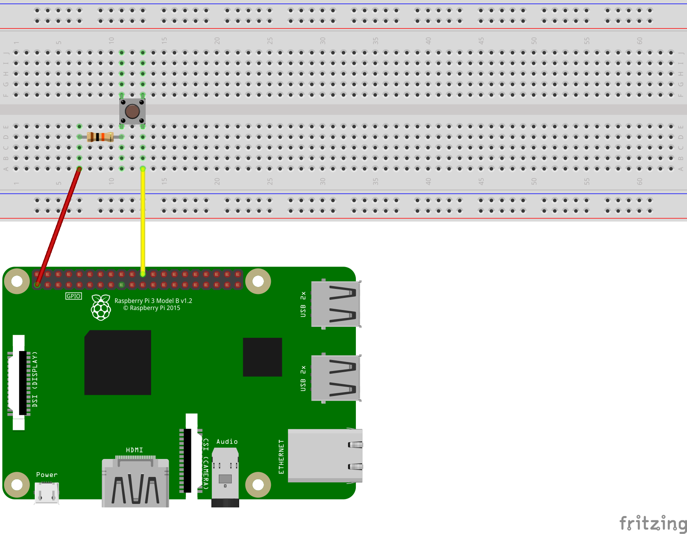
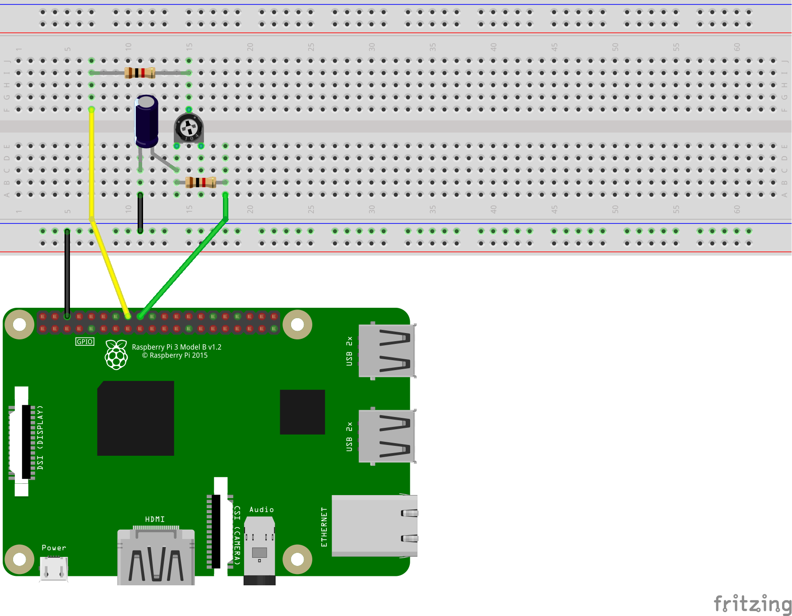
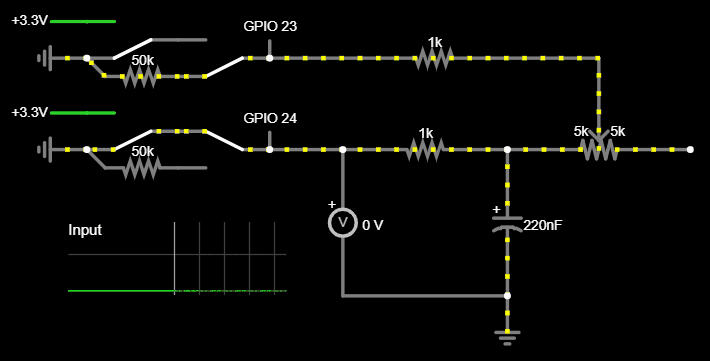
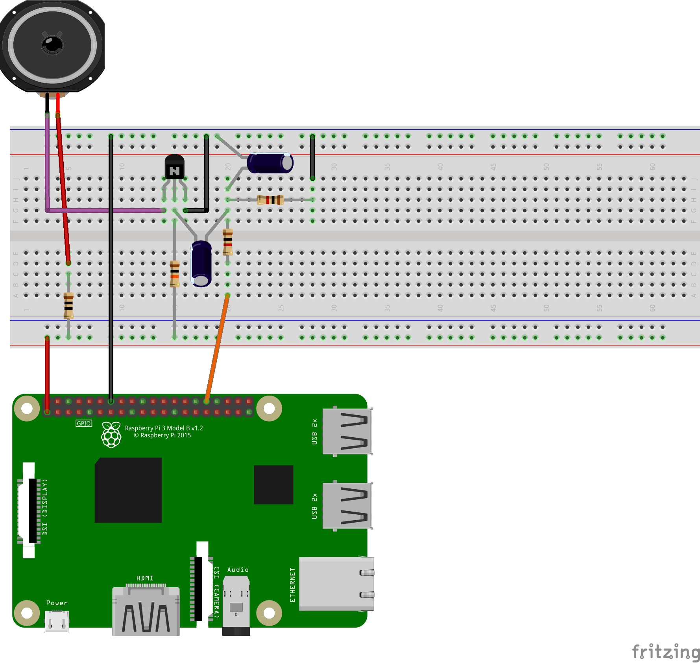

# Electronics With The Raspberry Pi

If you have any questions or get stuck as you work through this in-class exercise, please ask the instructor for assistance. Enjoy!

## Blink
1.  We begin this activity with a classic example of GPIO (general purpose input or output) control. Connect an LED in series with a 220&Omega; resistor between GPIO pin 25 and ground. <br>
2.  Create a new Python file: `sudo nano blink.py`
3.  Enter the following:
    ```
    import RPi.GPIO as gpio
    from time import sleep

    pin = 25
    gpio.setmode(gpio.BCM)
    gpio.setup(pin, gpio.OUT)

    while True:
        gpio.output(pin, gpio.HIGH)
        sleep(1)
        gpio.output(pin, gpio.LOW)
        sleep(1)
    ```
    The pin numbering is set to the Broadcom CPU's definitions with `gpio.setmode(gpio.BCM)` and pin 25 is initialized as an output with `gpio.setup(pin, gpio.OUT)`<br>
    GPIO pins can be in one of two states:
    -   0V (ground): `gpio.LOW`
    -   3.3V: `gpio.HIGH`
4.  Save and exit by pressing "ctrl" and "X" then "Y".
5.  Run the program and watch the LED blink on and off: `python3 blink.py`
6.  Press "ctrl" and "C" to exit the program.
    -   Note that exiting while the LED is on will cause it to stay on.

## Fade
7.  Despite GPIO pins being either on or off, the brightness of an LED or the speed of a motor can be controlled by switching the pin on and off *very* quickly. This technique is called Pulse Width Modulation (PWM).
8.  Keep the wiring of the blink example.
9.  Create a Python file named `fade.py` and enter the following:
     ```
     import RPi.GPIO as gpio
     from time import sleep

     pin = 25
     gpio.setmode(gpio.BCM)
     gpio.setup(pin, gpio.OUT)

     pwm = gpio.PWM(pin, 100)
     pwm.start(0)

     for dc in range(0, 100, 1):
         pwm.ChangeDutyCycle(dc)
         sleep(0.05)

     for dc in range(100, 0, -1):
         pwm.ChangeDutyCycle(dc)
         sleep(0.05)

     pwm.ChangeDutyCycle(0)
     ```
     Pin 25 is assigned pulse width modulation and the duty cycle (time interval of the pulses) is increased then decreased incrementally.
10.  Upon running this program, the LED will appear to get brighter then dimmer.

## Push Button
11.  Connect a momentary push button in series with a 10k&Omega; resistor between GPIO pin 25 and 3.3V power. <br>
12.  Create a Python file named `button.py` and enter the following:
     ```
     import RPi.GPIO as gpio

     pin = 25
     gpio.setmode(gpio.BCM)
     gpio.setup(pin, gpio.IN, pull_up_down=gpio.PUD_DOWN)

     while True:
         if gpio.input(pin) == gpio.HIGH:
             print("Button Pushed")
     ```
     The new parameter `pull_up_down=gpio.PUD_DOWN` will internally connect the pin to ground with a very high value resistor.
13.  Run the program and then press the button. The terminal should be filled with "Button Pushed" due to the while loop repeating many times per second.
14.  In some cases, a more useful approach to GPIO input is callbacks. These work by interrupting the program to call a function. In this example, `buttonPressedCallback` will interrupt a counting process:
     ```
     import RPi.GPIO as gpio
     from time import sleep

     def buttonPressedCallback(channel):
         print("Pressed")

     pin = 25
     gpio.setmode(gpio.BCM)
     gpio.setup(pin, gpio.IN, pull_up_down=gpio.PUD_DOWN)
     gpio.add_event_detect(pin, gpio.RISING, callback=buttonPressedCallback)
     i = 0
     
     while True:
         print(i)
         i = i + 1
         sleep(1)
     ```
     The parameter `gpio.RISING` specifies calling the function when the state changes from low to high. Alternatively, `gpio.FALLING` could have been used for high to low or `gpio.BOTH` for either case.

## Analog Input
15.  Once again we encounter the obstacle of binary state GPIO pins. However, analog to digital conversion is still possible by measuring the amount of time a capacitor takes to charge from a "LOW" to a "HIGH" voltage level.
16.  List of Parts:
     -   1x Potentiometer (Variable Resistor)
     -   1x 0.22&mu;F Capacitor
     -   2x 1k&Omega; Resistor
     -   Wires
17.  Connect the components as shown in this diagram: <br><span style="color:red">**Warning: This type of capacitor is known to explode if connected backwards. The side of the capacitor marked with a line can only be connected to ground or a lower voltage potential.**</span> <br>
18.  Create a Python file named `analog.py` and enter the following:
     ```
     import RPi.GPIO as gpio
     from time import sleep

     pin1 = 23
     pin2 = 24
     gpio.setmode(gpio.BCM)

     def discharge():
         gpio.setup(pin1, gpio.IN)
         gpio.setup(pin2, gpio.OUT)
         gpio.output(pin2, gpio.LOW)
         sleep(0.004)

     def chargeTime():
         gpio.setup(pin1, gpio.OUT)
         gpio.setup(pin2, gpio.IN)
         gpio.output(pin1, gpio.HIGH)
         t = 0
         while not gpio.input(pin2):
             t = t + 1
         return t

     def analogRead():
         discharge()
         return chargeTime()

     while True:
         print(analogRead())
         sleep(1)
     ```
19.  Run the program and watch the printed value change as you turn the knob of the potentiometer. The animation below helps to visualize what is happening many times per second. <br>

## GPIO Audio
20.  This final circuit will be a simple transistor amplifier to play audio using a hardware PWM pin. Keep in mind the audio quality of this circuit is going to be nowhere near excellent, and most models of the Raspberry Pi have a 3mm audio jack for connecting better quality speakers. The only practical use of this circuit would be playing audio from a [Raspberry Pi Zero](https://www.raspberrypi.com/products/raspberry-pi-zero/){:target="_blank"} with no audio jack.
21.  List of Parts:
     -   1x Speaker
     -   1x NPN BJT Type Transistor (The DSC has BC547s)
     -   1x 0.1&mu;F Capacitor
     -   1x 1&mu;F Capacitor
     -   2x 1k&Omega; Resistor
     -   1x 10k&Omega; Resistor
     -   Wires
22.  Connect the components as shown in this diagram: <br>
     <br>This circuit will not require another Python file.
23.  Edit the boot config file: `sudo nano /boot/config.txt`
24.  Add a new line `dtoverlay=audremap,pins_12_13` to the end of the file then save and exit.
25.  Test the audio output: `speaker-test -c2`
26.  Wait until you hear static, then press “ctrl” and “C” to exit.
27.  Open Chromium and browse for music on YouTube. You will notice piano notes in particular are extremely distorted. I warned you about the audio quality!

[NEXT STEP: Google Assistant](act-6.html){: .btn .btn-blue }
