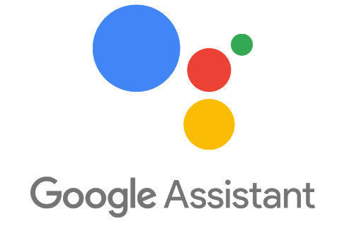
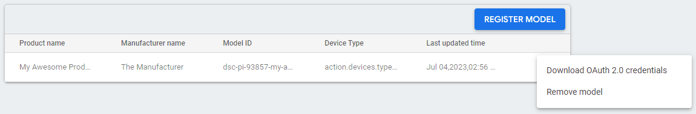
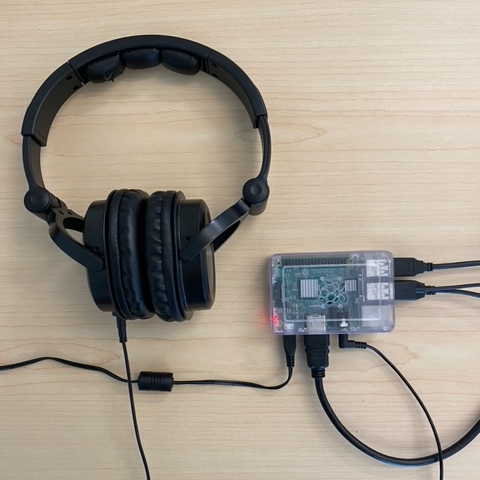
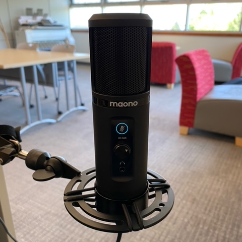
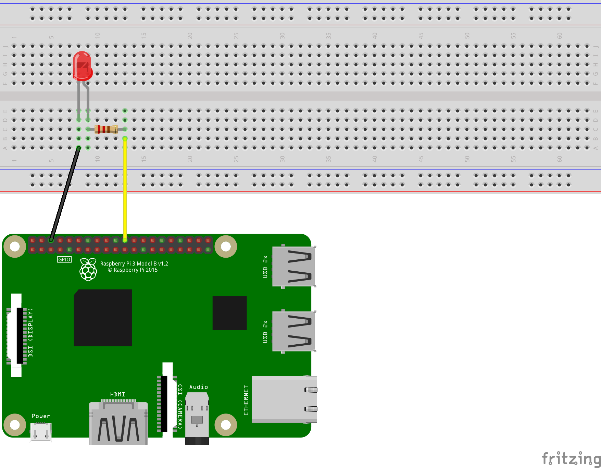

# Google Assistant

If you have any questions or get stuck as you work through this in-class exercise, please ask the instructor for assistance. Enjoy!

## Register For The Google API
1.  Log into the [Google Console Actions Dashboard](https://console.actions.google.com/){:target="_blank"} with your Google account (it is much faster to use your own computer and not Chromium on the Raspberry Pi).
2.  Click "New project", enter a name for the project and the country and language, then click "Create project".
3.  Click "Device registration" or the link after "Are you looking for device registration?" and keep this tab open.
4.  Go to the [Google Cloud Console](https://console.cloud.google.com/apis/library/embeddedassistant.googleapis.com){:target="_blank"}, select the project, and click "Enable".
5.  Configure the [OAuth consent screen](https://console.developers.google.com/apis/credentials/consent){:target="_blank"} for the project. Most of the fields will be optional.
6.  Go to the [Activity Controls](https://myaccount.google.com/activitycontrols){:target="_blank"} of your Google account and ensure that the following are enabled:
    -   Web & App Activity
        -   Include Chrome history and activity from sites, apps, and devices that use Google services
        -   Include voice and audio activity
    -   Device Information
7.  Go back to the device registration tab, click "REGISTER MODEL", and enter what you want for "Product name", "Manufacturer name", and "Device type".
8.  Click "Download OAuth 2.0 credentials" and make sure to keep track of the downloaded JSON file. Selecting traits should be skipped.
9.  If the model needs to be edited, click its entry on the list.
10.  If the credentials JSON file needs to be downloaded again, click the icon with three dots on the right of the list entry. 

## Raspberry Pi Installation
11.  Find a USB microphone and an audio jack speaker or headphones and connect them to the Raspberry Pi. <br>  
12.  Test the microphone and speaker by entering the terminal command `arecord --format=S16_LE --duration=5 --rate=16000 --file-type=raw out.raw` to record 5 seconds of audio and `aplay --format=S16_LE --rate=16000 out.raw` to replay the audio.
13.  Create a folder named `google_assistant` in the `/home/pi` directory. Rename the JSON file downloaded earlier to `credentials.json` and move it to this folder using a USB drive or by directly downloading the file to the Raspberry Pi from Chromium. Note that `/home/pi` assumes a username "pi" and should be corrected to the actual username if it is different.
14.  Before attempting any installations on the Raspberry Pi while connected to the UVIC network, ensure the correct time has been set and IPV6 is disabled as outlined in [activity 1](https://uviclibraries.github.io/raspberrypi/act-1.html){:target="_blank"}.
15.  Set up and activate the Python virtual environment:
     ```
     sudo apt-get update
     sudo apt-get install python3-dev python3-venv
     python3 -m venv env
     env/bin/python -m pip install --upgrade pip setuptools wheel
     source env/bin/activate
     ```
16.  Install the Google Assistant dependencies: `sudo apt-get install portaudio19-dev libffi-dev libssl-dev`
17.  Install the Google Assistant library and example programs (this installation might take a while): `python -m pip install --upgrade google-assistant-sdk[samples]`
18.  Install the Google Authorization Tool: `python -m pip install --upgrade google-auth-oauthlib[tool]`
19.  Because of issues with the current release of the Google Assistant as of writing, these fixes were required:
     -   Ensure the dependency Tenacity is installed: `sudo pip install -U tenacity`
     -   A Python file needs to be edited: `sudo nano ~/env/lib/python3.9/site-packages/googlesamples/assistant/grpc/audio_helpers.py`
     -   Go to line 57 by pressing "ctrl" and "-" then entering 57.
     -   The line `buf = arr.tostring()` needs to be `buf = arr.tobytes()` instead.
     -   Press "ctrl" and "X" then "Y" to save and exit.
20.  Generate the credentials: `google-oauthlib-tool --scope https://www.googleapis.com/auth/assistant-sdk-prototype --save --client-secrets ~/google_assistant/credentials.json`
21.  Chromium will automatically open and prompt you to sign in with your Google account. Press "Continue" to give the Google Assistant access to your account. The last line of output in the terminal should say: `credentials saved: /home/pi/.config/google-oauthlib-tool/credentials.json`
22.  Run the Google Assistant program: `googlesamples-assistant-pushtotalk`
23.  Press the enter key and try talking into the microphone.
24.  To close the program, press "ctrl" and "C" twice.

## "Ok Google..."
25.  In order for the hot word version of the Google Assistant to run properly, another Python file needs to be edited: `sudo nano ~/env/lib/python3.9/site-packages/googlesamples/assistant/library/hotword.py`
26.  Go to line 65 and change `with Assistant(credentials) as assistant:` to `with Assistant(credentials, "device-model-id") as assistant:` where `device-model-id` should be the model ID from the Actions Console. Save and exit.
27.  Run the hot word program: `googlesamples-assistant-hotword`
28.  Say "Ok Google" followed by any query or request into the microphone.

## Electronics and Voice Control
29.  Connect an LED in series with a resistor between GPIO pin 25 and ground. <br>
30.  Install the GPIO library to the Python environment: `sudo pip install RPi.GPIO`
31.  Open the hot word file again: `sudo nano ~/env/lib/python3.9/site-packages/googlesamples/assistant/library/hotword.py`
32.  Near the top of the file right below the `from` and `import` statements, add the line: `import RPi.GPIO as gpio`
33.  Add these lines to the start of the `def main():` method:
     ```
     gpio.setmode(gpio.BCM)
     gpio.setup(25, gpio.OUT)
     ```
     This sets the GPIO pin numbering to the Broadcom CPU's definitions and assigns pin 25 to be an output.
34.  Add these lines to the end of the `def process_event(event):` method:
     ```
     if event.type == EventType.ON_CONVERSATION_TURN_STARTED:
         gpio.output(25, gpio.HIGH)

     if event.type == EventType.ON_CONVERSATION_TURN_STARTED or event.type == EventType.ON_CONVERSATION_TURN_TIMEOUT or event.type == EventType.ON_NO_RESPONSE:
         gpio.output(25, gpio.LOW)
     ```
     Then save and exit.
35.  When using the hot word program, the LED should turn on when you say "Ok Google" and turn off when the Google Assistant is finished talking.
36.  
