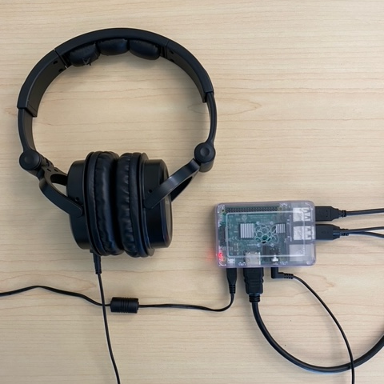
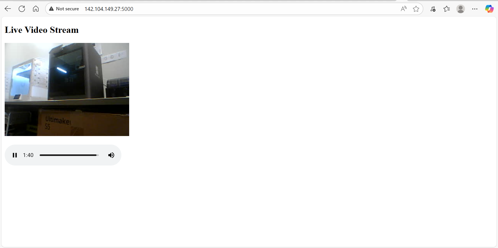
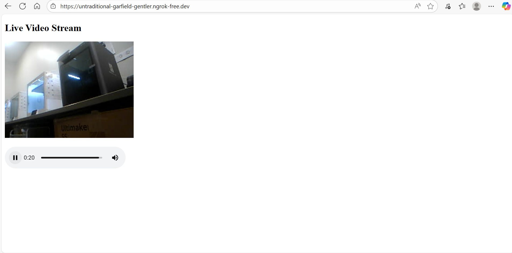

Use raspberry pi to setup your own live stream platform. You could also use it as a fully control remote surveillance camera system.


# pi-stream

If you have any questions or get stuck as you work through this in-class exercise, please ask the instructor for assistance. Enjoy!


## Raspberry Pi Installation
1.  Find a camera and a USB microphone and connect them to the Raspberry Pi. <br> 
2.  Power on the Raspberry Pi with monitor, and key board/mouse connected. Open the terminal in the Raspberry pi graphy interface(destop interface). Or remote login to the system with SSH.
   Instructions to login to the system with SSH as following:
   2.1. Connect your Raspberry Pi and your computer to same Ethernet network.
   2.2. Enable SSH on the Raspberry Pi by Using a monitor and keyboard:
      1. On your Raspberry Pi, open the Raspberry Pi Configuration tool by clicking the menu icon > Preferences > Raspberry Pi Configuration.
      2. Go to the Interfaces tab and select Enable next to SSH.
      3. Click OK to save the change.
      4. Alternatively, open a terminal and run sudo raspi-config. Navigate to Interfacing Options > SSH > <Yes>.
  2.3. Find the Raspberry Pi's IP Address by running the following command on the Raspberry Pi's terminal: 
     bash:
     hostname -I
     This will display the device's IP address (e.g., 142.104.149.27 and 206.87.94.158; The first one is the Ethernet network, the other one is for wirelss network).

  2.4. Use an SSH client on your computer to connect to the Pi. The default username is pi, and the default password (if you haven't changed it) is raspberry. 
     From Windows:
          Use a dedicated SSH client like PuTTY. Open PuTTY, enter the Raspberry Pi's IP address or hostname in the "Host Name (or IP address)" field, ensure the port is 22 and connection type is SSH, then click Open.
          Alternatively, use Windows PowerShell or Command Prompt (if you have the OpenSSH client installed on Windows 10/11).
          From macOS or Linux:
          Open a Terminal window.
      Enter the following command, replacing [username] and [IP address] with your details:
      bash
      ssh [username]@[IP address]
       (e.g., ssh pi@142.104.149.27).
       

  3. Test the camera:
      3.1 If you are using a CSI(with ribbon) or other non-USB cameras:
       Firstly install dependency:
           sudo apt update
           sudo apt install -y libcamera-apps
     Then run the command to capture:
           libcamera-still -o test.jpg
        If you can see test.jpg file in the same directory, open the test.jpg file in desktop, it verifies that the camera is working.
        Otherwise, if there are some errors output, please check the hardware, ribbon connection or there maybe some config issues.
      3.2 If you are using a USB camera:
        Firstly install dependency:
           sudo apt install v4l-utils
        Then run the command:
        v4l2-ctl --list-devices
        You will see something like below:
         unicam (platform:3f801000.csi):
        /dev/video1
        /dev/video2
        /dev/media3

        USB Camera-B4.09.24.1 (usb-3f980000.usb-1.3):
           /dev/video0
     
     From camera section, you will find the path for camera:  /dev/video0

  Use the command to generate a video:
   v4l2-ctl --device=/dev/video0 --all
   or
   ffplay /dev/video0
   If you see the video, it means that your camera is working.

  
  
4. Test the microphone and speaker
   4.1 List the microphone and audio devices:
   arecord -l
   You will see the output like this:
   **** List of CAPTURE Hardware Devices ****
card 2: CameraB409241 [USB Camera-B4.09.24.1], device 0: USB Audio [USB Audio]
  Subdevices: 0/1
  Subdevice #0: subdevice #0

Test mic recording
arecord -D hw:2,0 -f S16_LE -r 16000 test.wav
hw:2,0 corresponding to card number and device number

If you find a test.wav in the same directory and can be played by:

aplay test.wav

It means that microphone is working.

6.  By entering the terminal command `arecord --format=S16_LE --duration=5 --rate=16000 --file-type=raw out.raw` to record 5 seconds of audio and `aplay --format=S16_LE --rate=16000 out.raw` to replay the audio.

7.  Set up and activate the Python virtual environment:
     ```
     sudo apt-get update
     sudo apt-get install python3-dev python3-venv
     python3 -m venv env
     env/bin/python -m pip install --upgrade pip setuptools wheel
     source env/bin/activate
     ```
8.  Paste the code from CSI(ribbon) camera from https://github.com/uviclibraries/raspberrypi/blob/pi-camera/code/app.py and USB camera from https://github.com/uviclibraries/raspberrypi/blob/pi-camera/code/app_usb.py
   to the Linux editor (nano):
   sudo nano app.py
   or scp sourcecodepath/app.py to raspberrypiworkingdirectory/app.py


10. Run the code:
    You will see the output like this if everything is good:
     * Serving Flask app "app" (lazy loading)
     * Environment: production
      WARNING: This is a development server. Do not use it in a production deployment.
       Use a production WSGI server instead.
      * Debug mode: off
      * Running on http://0.0.0.0:5000/ (Press CTRL+C to quit)
        142.104.149.85 - - [13/Feb/2026 12:20:20] "GET / HTTP/1.1" 200 -
        142.104.149.85 - - [13/Feb/2026 12:20:20] "GET /video_feed HTTP/1.1" 200 -
        142.104.149.85 - - [13/Feb/2026 12:20:22] "GET /audio_feed HTTP/1.1" 200 -
        142.104.149.85 - - [13/Feb/2026 12:20:29] "GET /favicon.ico HTTP/1.1" 404 -

11. Open the browser and input the url, for instance: http://142.104.149.27:5000/, you will see the live stream:
    
    
    
12. With Grok, you can visit the website via the internet from any world in the world: https://untraditional-garfield-gentler.ngrok-free.dev/
    Open the broswer, you will see the live stream:
    
    
12.  Feel free to experiment. Any Raspberry pi supported cameras and microphone used on a Raspberry Pi can be made into a live stream system!
    

[NEXT STEP: Earn a Workshop Badge](informal-credentials.html){: .btn .btn-blue }
